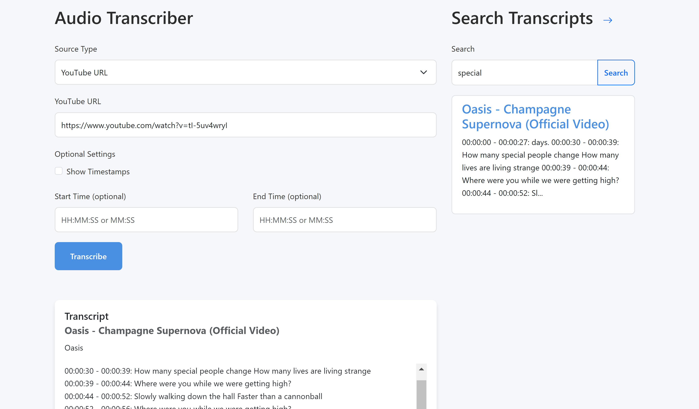

## Transcribe

Transcribe audio to text (using whisper). Runs locally.

### YouTube / File

Files: `transcribe.py`, `youtube_util.py`. Possibly select start and end time. 

Optional UI (served by flask) using `python -m src.app` to: 
- Prepare transcript from a YouTube link or a file.
- Text search the database (MongoDB) of transcripts. Note: stop words (like 'how', 'is', 'why') are not indexed.
- Edit saved transcripts.

Takes a few seconds for to transcribe a few minutes of audio, for example [this song](https://www.youtube.com/watch?v=tI-5uv4wryI) took less than 5 seconds on my pc using cuda:



### Real Time

File: `transcribe.py`. Output example:


### Speaker diarization

File: `speaker_diarization.py`, separating the speakers is done using `pyannote` (hugging face token required). Output example:

```
SPEAKER_01:  No introduction needed.
SPEAKER_03:  Welcome. I just agreed to this last minute, as you know.
...
```

## Settings and dependencies

Install and read the instructions for [torch](https://pytorch.org/), [pyannote](https://github.com/pyannote/pyannote-audio) (for separating speakers. hugging face token required), and install the other requirements.

Set device ID's in `settings.py` in order to record audio (helper functions are in `audio_util.py`).

For real-time transcription - there are probably better ways, but it works surprisingly well for short and fast transcriptions.

The model may hallucinate a bit, and be non-deterministic. 
